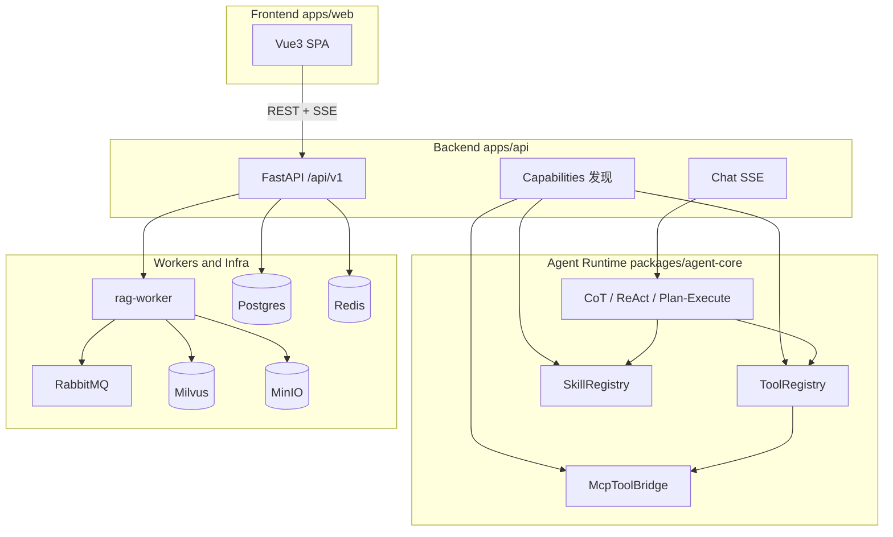
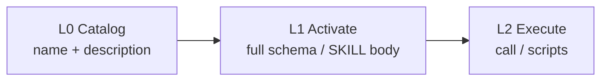

# 架构说明

## 1. 分层总览

前后端与能力面分离：Web 只经 HTTP/SSE 契约访问 API；Agent 运行时在后端包内编排；Tool / MCP / Skill 统一走渐进式披露。

| 层 | 路径 | 职责 |
|----|------|------|
| **Frontend** | `apps/web` | 管理台与对话 UI；统一 `/api/v1` 客户端；渲染 SSE 时间线 |
| **Backend API** | `apps/api` | 鉴权、对话 SSE、文档/Eval/用量、能力发现 |
| **Agent Runtime** | `packages/agent-core` | LangGraph 策略、checkpoint、HITL、Tool/MCP/Skill |
| **RAG / Shared** | `packages/rag`、`shared`、`llm-gateway`、`eval` | 检索入库、配置 Schema、网关、评测 |
| **Worker** | `apps/rag-worker` | RabbitMQ 消费者：parse → chunk → embed → index |

## 2. 前后端契约

- 前端**不**直连 Python 包；一律相对路径 `/api/v1/...`（开发 Vite 代理，生产 nginx 反代）。
- 鉴权头：`X-API-Key`。
- 对话：`POST /chat/stream`、`POST /chat/resume`，响应为 SSE：`event: {type}` + `data: ChatEvent JSON`。
- **ChatEvent.type**（契约源）：`token` | `thought` | `tool_start` | `tool_end` | `skill_start` | `skill_end` | `plan` | `citation` | `final` | `error` | `strategy` | `hitl`
- 能力发现：
  - `GET /capabilities/tools`
  - `GET /capabilities/skills`（`?name=` 返回 L1 正文）
  - `GET /capabilities/mcp`

## 3. Tool / MCP / Skill 渐进式披露

| 层 | Tool | MCP | Skill |
|----|------|-----|-------|
| L0 | name + 一行描述进系统提示 | server + tool 名 | `skills/*/SKILL.md` frontmatter |
| L1 | 解锁后暴露完整 OpenAI function schema | 解锁后暴露完整 schema | `activate_skill` 注入正文并解锁声明的 tools/mcp |
| L2 | `ToolRegistry.call` | `McpToolBridge.call` | 可选 `scripts/`（白名单、超时） |

- **Core 工具**（始终 L1）：`retrieve`、`calculator`。
- **Optional / MCP**：默认仅 L0；经 Skill 激活或元工具解锁后进入 LLM `tools=`。
- **ReAct 元工具**（始终 L1）：`list_skills`、`activate_skill`、`list_tools`。
- Skills 目录：仓库根 `skills/<name>/SKILL.md`（YAML frontmatter + Markdown）；可配置 `SKILLS_DIR`。
- MCP：`MCP_SERVERS_JSON` 为 stdio server 列表；启动时连接并缓存 schema，按 unlocked 过滤披露。

## 4. 技术选型

| 决策 | 理由 |
|------|------|
| LangGraph | CoT/ReAct/Plan-Execute，checkpoint / HITL |
| RabbitMQ | 入库工作队列，DLX / 重试 |
| Milvus | dense + sparse Hybrid + RRF |
| Postgres | 文档/Job/用量 + LangGraph checkpoint |
| Redis | 网关分布式限流 |
| MinIO | 原文与解析产物 |
| Vue3 SPA | 管理台与对话 SSE |
| FastAPI | 异步 API，与 Python Agent 生态一致 |

## 5. Agent 三范式

1. **CoT**：检索一次后显式推理；可附带预激活 Skill 正文
2. **ReAct**：Thought→Action→Observation；元工具 + 渐进解锁；`max_iterations` + 重复工具检测
3. **Plan-and-Execute**：先计划后执行；可 HITL；executor 走 `ToolRegistry.call` 与当前 unlocked

企业可控：限步、checkpoint、HITL、SSE 可观测、Critic。

## 6. RAG 异步解耦

API 上传 → MinIO → 发布 `rag.parse`；Worker：parse → chunk → embed → index。
状态回写 Postgres。Retrieve：rewrite → hybrid → RRF → rerank → context。

## 7. 网关与 Eval

LiteLLM / httpx 适配；Redis 限流、熔断、fallback、用量落库。
Eval：Retrieval → Generation → Trajectory（含工具/技能轨迹）。

## 8. 部署

Compose 拉起全栈；Helm 提供副本、探针、HPA（worker）。生产关闭内存兜底，强制 API Key。
