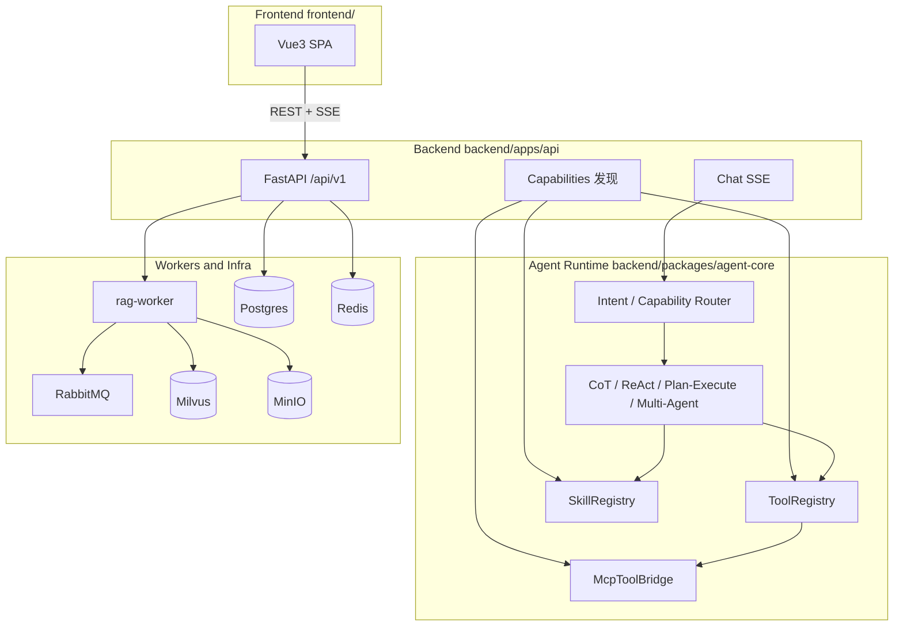
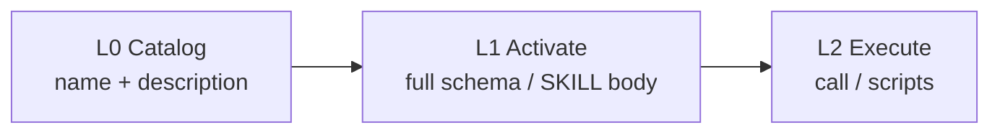

# 架构说明

## 1. 分层总览

前后端与能力面分离：Web 只经 HTTP/SSE 契约访问 API；Agent 运行时在后端包内编排；Tool / MCP / Skill 统一走渐进式披露。

| 层 | 路径 | 职责 |
|----|------|------|
| **Frontend** | `frontend/` | 管理台与对话 UI；统一 `/api/v1` 客户端；渲染 SSE 时间线 |
| **Backend API** | `backend/apps/api` | 鉴权、对话 SSE、文档/Eval/用量、能力发现与 CRUD、提示词版本 |
| **Agent Runtime** | `backend/packages/agent-core` | LangGraph 策略、checkpoint、HITL、Tool/MCP/Skill |
| **RAG / Shared** | `backend/packages/{rag,shared,llm-gateway,eval}` | 检索入库、配置 Schema、网关、评测、能力 Store |
| **Worker** | `backend/apps/rag-worker` | RabbitMQ 消费者：parse → chunk → embed → index |

## 2. 前后端契约

- 前端**不**直连 Python 包；一律相对路径 `/api/v1/...`（开发 Vite 代理，生产 nginx 反代）。
- 鉴权头：`X-API-Key`。
- 对话：`POST /chat/stream`、`POST /chat/resume`，响应为 SSE：`event: {type}` + `data: ChatEvent JSON`。
- Run 指针查询：`GET /chat/runs?session_id=`、`GET /chat/runs/{run_id}`（仅 session/run/trace/langfuse_url/status，不含 tool 轨迹）。
- **ChatEvent.type**（契约源）：`token` | `thought` | `tool_start` | `tool_end` | `skill_start` | `skill_end` | `plan` | `citation` | `final` | `error` | `strategy` | `hitl` | `intent` | `agent_start` | `agent_end`
- `strategy` / `final` / `error` / `hitl` 携带 `session_id`、`run_id`、`trace_id`、`langfuse_url`。
- **能力路由**：入图前 `classify_routing` 产出 `enable_rag` / `enable_web_search` / `strategy` / `skills` / `agents`；`ChatRequest.enable_rag=null` 时由路由决定，显式 true/false 可覆盖。
- 能力发现（L0 只读，供 Chat/Agent）：
  - `GET /capabilities/tools`
  - `GET /capabilities/skills`（`?name=` 返回 L1 正文）
  - `GET /capabilities/mcp`
- 能力管理（独立 Store + CRUD，经装配层热注入 Runtime）：
  - Tools：`GET/POST /tools`，`GET/PUT/DELETE /tools/{name}`，`PATCH /tools/{name}/enabled`
  - Skills：`GET/POST /skills`，`GET/PUT/DELETE /skills/{name}`，`PATCH /skills/{name}/enabled`
  - MCP：`GET/POST /mcp`，`GET/PUT/DELETE /mcp/{name}`，`PATCH /mcp/{name}/enabled`，`POST /mcp/{name}/reconnect`
  - 边界：`ToolStore` / `SkillStore` / `McpStore`（shared）⇄ `CapabilitySync`（API 装配）⇄ `ToolRegistry` / `SkillRegistry` / `McpToolBridge`（agent-core）
  - 动态 Tool 执行体仅为 **HTTP Webhook**；内置工具只读，可启用/禁用
- 提示词版本（独立能力，经装配层注入 Agent）：
  - `GET /prompts` / `GET /prompts/{key}`
  - `POST /prompts/{key}/versions`（发版，默认同步激活）
  - `POST /prompts/{key}/rollback`（回退到历史版本号，保留全部版本）
  - 边界：`PromptStore`（shared）⇄ `PromptStoreProvider`（API 装配）⇄ `PromptProvider` 端口（agent-core）；Agent 默认可仅用内置 Provider 独立运行

## 3. Tool 正确性门禁（事前 / 事中 / 事后）

| 阶段 | 机制 | 落点 |
|------|------|------|
| **事前** | 渐进披露缩小工具面；schema 含 `required` / `minLength` / `additionalProperties:false`；ReAct system 含工具调用规范 | `ToolRegistry` L0/L1、`prompts.react.system`、路由解锁 |
| **事中** | `call()` 前：启用/解锁可见性 → JSON Schema 参数校验 → `call_id` 幂等缓存；非法 JSON 在 reason 节点直接回灌 | `agent_core/tools/guard.py`、`ToolRegistry.call`、`strategies/react.py` |
| **事后** | 结果契约 `ok` 归一；空检索/空搜索打 `warning`；业务库只存 Langfuse 指针，轨迹正文在 Langfuse | `normalize_result`、`agent_runs`、Langfuse |

可修复错误统一结构：`ok=false` + `error_code` + `fixable` + `hint`（如 `invalid_args` / `tool_locked`），供模型改参重试。

## 3.1 Tool / MCP / Skill 渐进式披露

| 层 | Tool | MCP | Skill |
|----|------|-----|-------|
| L0 | name + 一行描述进系统提示 | server + tool 名 | Store 中启用 Skill 的 name/description |
| L1 | 解锁后暴露完整 OpenAI function schema | 解锁后暴露完整 schema | `activate_skill` 注入正文并解锁声明的 tools/mcp |
| L2 | `ToolRegistry.call`（含 Webhook） | `McpToolBridge.call` | 可选 `scripts/`（需文件系统 path） |

- **Core 工具**（始终 L1，可禁用）：`retrieve`、`calculator`。`retrieve` 在 tool 层读取 `state.enable_rag`，为 false 时跳过。
- **Optional / Webhook / MCP**：默认仅 L0；经 Skill 激活或元工具解锁后进入 LLM `tools=`。含 `http_get`、`web_search`（Tavily，需 `WEB_SEARCH_API_KEY`）。
- **ReAct 元工具**（始终 L1）：`list_skills`、`activate_skill`、`list_tools`。
- **持久化**：Postgres（`capability_tools` / `capability_skills` / `capability_mcp_servers`）为运行时源；写操作经 `CapabilitySync` 热注入。
- **种子**：首次启动从 `skills/*/SKILL.md`（`SKILLS_DIR`）与 `MCP_SERVERS_JSON` 导入，已存在不覆盖；之后以 DB 为准。种子含 `kb-qa` / `calc-assist` / `web-research`。
- **Webhook Tool**：CRUD 存 URL/headers/schema；调用时 `httpx` POST JSON arguments。

## 4. 技术选型

| 决策 | 理由 |
|------|------|
| LangGraph | CoT/ReAct/Plan-Execute/Multi-Agent，checkpoint / HITL |
| RabbitMQ | 入库工作队列，DLX / 重试 |
| Milvus | dense + sparse Hybrid + RRF |
| Postgres | 文档/Job/用量/提示词版本/能力 CRUD + LangGraph checkpoint |
| Redis | 网关分布式限流 |
| MinIO | 原文与解析产物 |
| Vue3 SPA | 管理台与对话 SSE |
| FastAPI | 异步 API，与 Python Agent 生态一致 |

## 5. Agent 策略范式

1. **CoT**：检索一次后显式推理；可附带预激活 Skill 正文
2. **ReAct**：Thought→Action→Observation；元工具 + 渐进解锁；`max_iterations` + 重复工具检测
3. **Plan-and-Execute**：先计划后执行；可 HITL；executor 走 `ToolRegistry.call` 与当前 unlocked
4. **Multi-Agent**：Supervisor 用 LangGraph `Send` **并行 fan-out** 到 `rag` / `web` / `calc` 专员（按路由子集）→ 等待齐后 **fan-in** Synthesizer → Critic；SSE 发 `agent_start` / `agent_end`

企业可控：限步、checkpoint、HITL、SSE 可观测、Critic、能力路由。

## 6. RAG 异步解耦

API 上传 → MinIO → 发布 `rag.parse`；Worker：parse → chunk → embed → index。
状态回写 Postgres。Retrieve：rewrite → hybrid → RRF → rerank → context。

## 7. 网关与 Eval

业务 `LLMGateway` 经 LiteLLM SDK 调用 **LiteLLM Proxy**（一把 `LLM_API_KEY` / `LITELLM_MASTER_KEY`）；
厂商真密钥只配在 Proxy（`deploy/litellm/config.yaml` + 环境变量）。
网关层另做 Redis 限流、熔断、fallback、用量落库。
Eval：Retrieval → Generation（**DeepEval** Faithfulness / AnswerRelevancy）→ Trajectory
（工具/技能轨迹；可选 DeepEval ToolCorrectness）。评判 LLM 经业务 `LLMGateway` → LiteLLM Proxy。
CLI：`scripts/run_eval.py --mode mock|live`；CI 仅跑 mock + 阈值门禁（不调 DeepEval LLM）。

## 8. Observability（Langfuse）

本地自托管 Langfuse v3（`deploy/langfuse/`，与主 Compose 隔离）。
`LANGFUSE_ENABLED=true` 时，`AgentRuntime.run_stream` 经 Langfuse CallbackHandler 上报
LangGraph LLM / tool span。

**轨迹真相源 = Langfuse**（完整 LLM/tool span、耗时、回放）。
业务 Postgres 表 `agent_runs` **只存指针**：`run_id` / `session_id` / `trace_id` / `langfuse_url` / `strategy` / `status`，
在 SSE `strategy|final|error|hitl` 时 upsert；**不双写** tool args/results。
评测或审计需要轨迹正文时，按 `langfuse_url` / `trace_id` 到 Langfuse 查看或按需导出。
管理台提供 Langfuse 外链。生产可另用 Helm 部署 Langfuse，本仓库不捆绑。

## 9. 部署

Compose 拉起全栈（含 `litellm` 服务，`:4000`）；Helm 提供 api/worker/web/litellm、探针、HPA（worker）。
生产关闭内存兜底，强制 API Key。`make langfuse-up` 可选拉起追踪栈。
